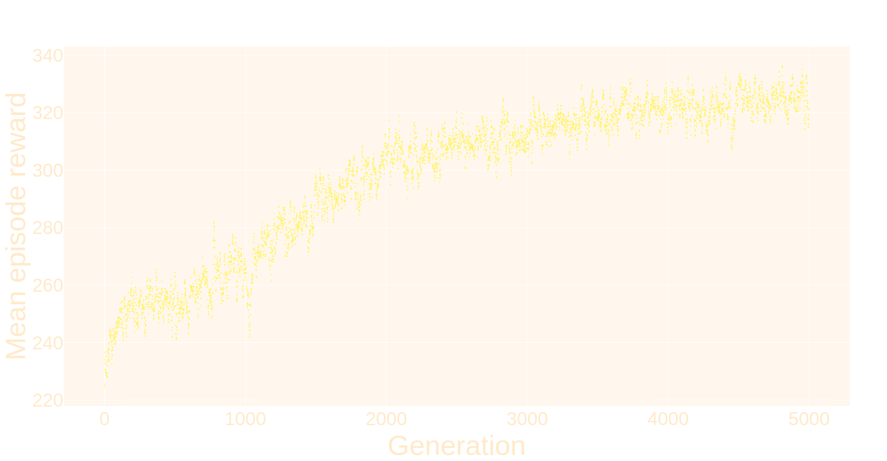
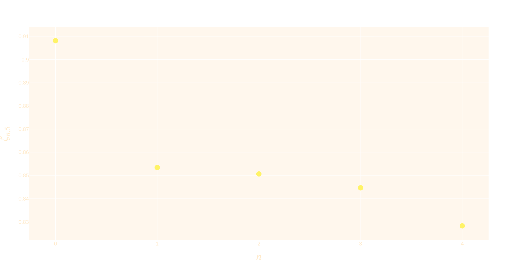

# Stubborn: An Environment for Evaluating Stubbornness between Agents with Aligned Incentives

* [Video](http://r.rachum.com/stubborn-video)
* [Slide deck](http://r.rachum.com/stubborn-deck)

*Stubborn* is an experiment in the field of [multi-agent reinforcement learning](https://en.wikipedia.org/wiki/Multi-agent_reinforcement_learning). The goal of the experiment is to see whether reinforcement learning agents can learn to communicate important information to each other by fighting with each other, even though they are "on the same side". By running the experiment and generating plots using the commands documented below, you could replicate the results shown in our paper. By modifying the environment rules as defined in the code, you could extend the experiment to investigate this scenario in different ways.

*Stubborn* will be presented at the [Workshop on Rebellion and Disobedience in AI](https://sites.google.com/view/rad-ai/) at [The International Conference on Autonomous Agents and Multiagent Systems](https://aamas2023.soton.ac.uk/). Read the [full paper](http://r.rachum.com/stubborn-paper). Abstract:

> Recent research in multi-agent reinforcement learning (MARL) has shown success in learning social behavior and cooperation. Social dilemmas between agents in mixed-sum settings have been studied extensively, but there is little research into social dilemmas in fully cooperative settings, where agents have no prospect of gaining reward at another agent’s expense.
>
> While fully-aligned interests are conducive to cooperation between agents, they do not guarantee it. We propose a measure of "stubbornness" between agents that aims to capture the human social behavior from which it takes its name: a disagreement that is gradually escalating and potentially disastrous. We would like to promote research into the tendency of agents to be stubborn, the reactions of counterpart agents, and the resulting social dynamics.
>
> In this paper we present Stubborn, an environment for evaluating stubbornness between agents with fully-aligned incentives. In our preliminary results, the agents learn to use their partner’s stubbornness as a signal for improving the choices that they make in the environment. [Continue reading...](http://r.rachum.com/stubborn-paper)


## Installation

```shell
python3 -m venv "${HOME}/stubborn_env"
source "${HOME}/stubborn_env/bin/activate"
pip3 install stubborn
```


## Documentation

Show list of commands:

```shell
python -m stubborn --help
```

Show arguments and options for a specific command:

```shell
python -m stubborn run --help
```


## Basic usage

### Running

Run the *Stubborn* experiment, training agents and evaluating their performance:

```shell
python3 -m stubborn run
```

### Plotting

There are two plot commands implemented. Each of them, by default, draws a plot for the very last run that you made.

Draw a plot showing the rewards of both agents as they learn:

```shell
python3 -m stubborn plot-reward
```



Draw a plot showing the insistence of one agent as a function of the other agent's stubbornness, defined as $\zeta_{n,d}$ in the paper:

```shell
python3 -m stubborn plot-insistence
```




## Citing

If you use *Stubborn* in your research, please cite the accompanying paper:

```bibtex
@article{Rachum2023Stubborn,
  title={Stubborn: An Environment for Evaluating Stubbornness between Agents with Aligned Incentives},
  author={Rachum, Ram and Nakar, Yonatan and Mirsky, Reuth},
  year = {2023},
  journal = {Proceedings of the Workshop on Rebellion and Disobedience in AI at The International Conference on Autonomous Agents and Multiagent Systems}
}
```